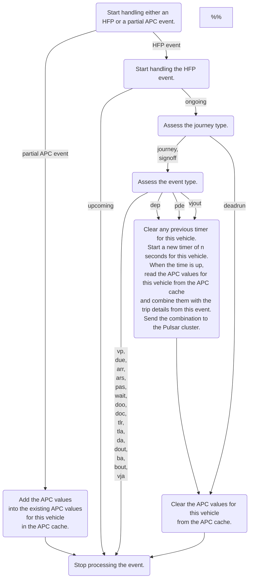

# transitdata-partial-apc-expander-combiner

Expand partial APC messages with trip metadata and combine them by stops to create full APC messages.

Expand all of the partial APC messages from vehicles with trip metadata from HFP messages.
Use vehicle IDs to map between the partial APC messages and the HFP messages.
Combine the expanded messages by stops so that the combined messages look like full APC messages.

This project depends indirectly on [transitdata-common](https://github.com/HSLdevcom/transitdata-common) project for the Protobuf proto definition files though the files have been slightly modified.

## Business logic



## Development

1. Install [the build dependencies for the Apache Pulsar C++ client](https://pulsar.apache.org/docs/en/client-libraries-cpp/#system-requirements).
1. Create a suitable `.env` file for configuration.
   Check below for the configuration reference.
1. Install dependencies:

   ```sh
   npm install
   ```

1. Run linters and tests and build:

   ```sh
   npm run check-and-build
   ```

1. Load the environment variables:

   ```sh
   set -a
   source .env
   set +a
   ```

1. Run the application:

   ```sh
   npm start
   ```

## Docker

You can use the Docker image `ghcr.io/hsldevcom/transitdata-partial-apc-expander-combiner:edge`.
Check out [the available tags](https://github.com/HSLdevcom/transitdata-partial-apc-expander-combiner/pkgs/container/transitdata-partial-apc-expander-combiner).

## Configuration

| Environment variable                | Required? | Default value | Description                                                                                                                                                                                                                                                                                                                                                                                                                      |
| ----------------------------------- | --------- | ------------- | -------------------------------------------------------------------------------------------------------------------------------------------------------------------------------------------------------------------------------------------------------------------------------------------------------------------------------------------------------------------------------------------------------------------------------- |
| `APC_WAIT_IN_SECONDS`               | ❌ No     | `6`           | After receiving an HFP event that would trigger sending APC data onwards, wait and accumulate APC data for this many seconds before sending the data.                                                                                                                                                                                                                                                                            |
| `VEHICLE_CAPACITIES`                | ✅ Yes    |               | A map from unique vehicle IDs (`<owning_operator_id>/<vehicle_number>`) to the passenger capacity of the vehicles. The format is a stringified JSON array of arrays containing [string, number] pairs, like the output of `JSON.stringify([...Map.prototype.entries()])`. Each operator ID is 4 characters long and each vehicle number is 5 characters long. An example value could be `[["0001/00001",67],["0012/00123",56]]`. |
| `DEFAULT_VEHICLE_CAPACITY`          | ❌ No     | `78`          | The default passenger capacity to use when a vehicle is not listed in `VEHICLE_CAPACITIES`.                                                                                                                                                                                                                                                                                                                                      |
| `HEALTH_CHECK_PORT`                 | ❌ No     | `8080`        | Which port to use to respond to health checks.                                                                                                                                                                                                                                                                                                                                                                                   |
| `PULSAR_BLOCK_IF_QUEUE_FULL`        | ❌ No     | `true`        | Whether the send operations of the producer should block when the outgoing message queue is full. If false, send operations will immediately fail when the queue is full.                                                                                                                                                                                                                                                        |
| `PULSAR_COMPRESSION_TYPE`           | ❌ No     | `LZ4`         | The compression type to use in the topic `PULSAR_PRODUCER_TOPIC`. Must be one of `Zlib`, `LZ4`, `ZSTD` or `SNAPPY`.                                                                                                                                                                                                                                                                                                              |
| `PULSAR_HFP_CONSUMER_TOPIC`         | ✅ Yes    |               | The topic to consume HFP messages from.                                                                                                                                                                                                                                                                                                                                                                                          |
| `PULSAR_HFP_SUBSCRIPTION`           | ✅ Yes    |               | The name of the subscription for reading messages from `PULSAR_HFP_CONSUMER_TOPIC`.                                                                                                                                                                                                                                                                                                                                              |
| `PULSAR_PARTIAL_APC_CONSUMER_TOPIC` | ✅ Yes    |               | The topic to consume partial APC messages from.                                                                                                                                                                                                                                                                                                                                                                                  |
| `PULSAR_PARTIAL_APC_SUBSCRIPTION`   | ✅ Yes    |               | The name of the subscription for reading messages from `PULSAR_PARTIAL_APC_CONSUMER_TOPIC`.                                                                                                                                                                                                                                                                                                                                      |
| `PULSAR_PRODUCER_TOPIC`             | ✅ Yes    |               | The topic to send full APC messages to.                                                                                                                                                                                                                                                                                                                                                                                          |
| `PULSAR_SERVICE_URL`                | ✅ Yes    |               | The service URL.                                                                                                                                                                                                                                                                                                                                                                                                                 |
